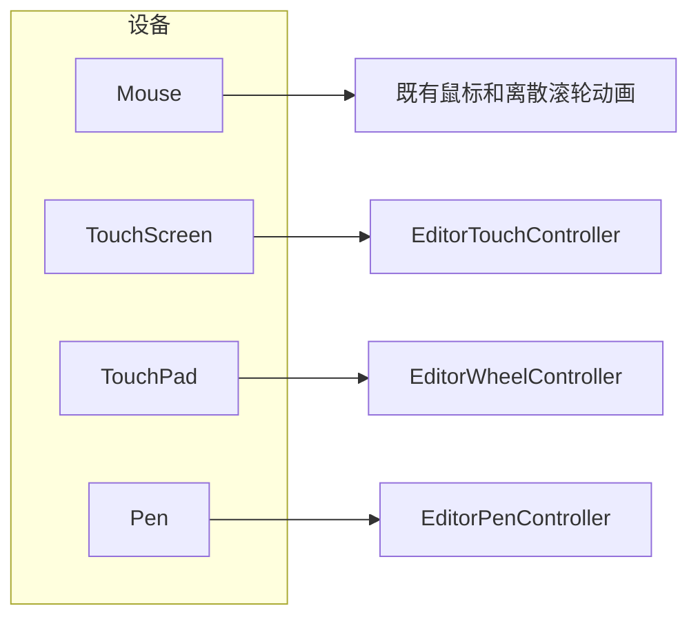

# 输入按设备种类处理（不使用 Direct Manipulation）

编辑器不注册、不链接 Windows Direct Manipulation。触屏、笔、精确式触摸板默认可用，外观设置里没有触摸相关开关与文案；鼠标和离散滚轮保持原样。编辑器画布内的触摸与笔语义见 `touch-and-pen-input-design.md`，本文记录画布之外的部分：分流总则、精确式触摸板与设置兼容。

## 为什么不能保留 Direct Manipulation

`IDirectManipulationManager::Activate(hwnd)` 按**整扇窗口**接管输入。`Touchpad | Wheel` 的设备掩码只决定 QWDMH 把哪些 `WM_POINTERUPDATE` 送进 `SetContact`，挡不住触屏触点被系统交出去——交出去之后没有任何视口认领，指针帧停在按下位置，双指因此卡死。因此以下做法都被否决：

- 把 `registerWindow` 的设备掩码再收成 `Touchpad | Wheel` 后注册回去；
- 保留 `enableDirectManipulation`，只把默认改成 false（启动路径曾无条件调用 `registerDirectManipulation()`，配置值挡不住 `Activate`）；
- 在编辑器 HWND 上再调用 `Activate`。

## 输入去向

- `Mouse`：不吞。离散滚轮在动画开时做动画，关时即时跳变。
- `TouchScreen`：`QTouchEvent` 交给 `EditorTouchController`。平台把主触点提升成的鼠标是重复流，按设备类型吞掉——不看 `source()`，它在 Windows 上是粘滞的（触点之前若有鼠标或触摸板的 `WM_POINTER`，被提升的触摸鼠标会以 `MouseEventNotSynthesized` 进来）。
- `Stylus`、`Airbrush`、`Puck`：仍走 `EditorPenController` 的 tablet 路径。笔尖、侧键、反端的现有语义不变。
- `TouchPad`：只走滚轮和 `QNativeGestureEvent`。它不是手指，不进 `EditorTouchController`，`EditorPointer::isTouchDevice()` 只认 `TouchScreen`。

## 精确式触摸板（EditorWheelController）

Qt 在窗口没有 `Activate` 时，把 `PT_TOUCHPAD` 交成带 `pixelDelta` 和滚动相位的 `QWheelEvent`，把捏合交成 `QNativeGestureEvent`。触摸板逻辑收口在 `src/app/UI/Views/Common/EditorWheelController.cpp`，Legacy 与两个 RHI 后端的 `event()` 调用同一份实现，不要在各视图复制。

平移：

- `pixelDelta` 即时改视口，并按最近一段时间的位移记下速度；
- `ScrollEnd` 用与双指平移同一套衰减做松手滑行（间隔 16 ms、衰减 3.6/秒、低于 20 px/s 停止），不另起一套手感；
- 新的滚轮、原生手势或鼠标按下停掉滑行；
- `ScrollMomentum` 相位是系统自己在滑：只应用这些增量，不再启动编辑器的滑行，避免两段惯性叠加。

捏合：

- 处理 `BeginNativeGesture`、`ZoomNativeGesture`、`EndNativeGesture`，横向和纵向都缩放，锚点是事件位置映射到控件后的 x 和 y（与双指 `zoomTouchViewportBy` 的两个因子一致）；
- `EndNativeGesture` 按最近的缩放速度做一段短惯性，衰减与平移同一套，下一次滚轮、手势或按下取消它；
- `BeginNativeGesture` 停掉进行中的平移惯性与缩放惯性。

像素增量不是离散事件，不进离散滚轮的动画档。

## 设置与配置兼容

- 外观页没有 Touch 卡片：没有开关，没有提示文案。
- 旧配置键 `appearance.enableTouchGestures` 与 `appearance.enableDirectManipulation` 不再读写；旧文件里的键被忽略，下次保存时消失。不要把缺键解释成关闭。
- `EditorTouchController` 没有开关，控件始终接受 `QTouchEvent`。
- `EditorSystemGestureSuppressor` 在已登记的编辑区窗口上始终应答 `WM_TABLET_QUERYSYSTEMGESTURESTATUS`，不读外观选项。
- 鼠标滚轮的平滑与否仍由外观里的动画开关决定。

## 回归要点

- 全仓库不出现 `WITH_DIRECT_MANIPULATION`、`QWDMH`、`registerDirectManipulation`、`enableDirectManipulation`、`enableTouchGestures`。
- 鼠标滚轮仍受动画开关控制；精确式触摸板的像素平移不走这档动画。
- 钢琴卷帘、参数编辑器、轨道编排区的捏合都走 `EditorWheelController`，横向和纵向都缩放，锚点含 x 和 y。
- `ScrollEnd` 有编辑器惯性，`ScrollMomentum` 不叠加，新输入能停掉滑行。
- 吞合成鼠标看设备类型，不看 `source()`；自己的 `sendSyntheticMouse` 不会被吞掉。
- `isTouchDevice` 不含 `TouchPad`。
- 触控板用户回归确认平滑滚动、捏合与松手惯性正常。
- `package-dml-portable` 的 `DsEditorLite` 能配置并链接通过；TouchProbe 不提供 Direct Manipulation 开关。
