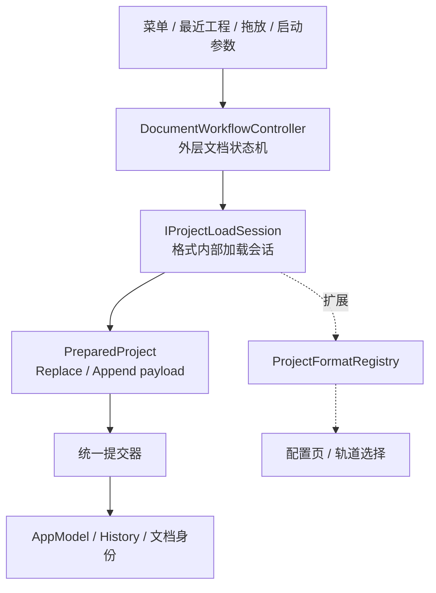

# 文档工作流与多格式导入 — 设计文档

> 状态：✅ 实施完成（2026-08-08）
> 本文由 docs/plans/document-workflow-and-multi-format-import-plan.md 整理而来；分阶段实施记录与提交清单已移除。

DSPX 异步读取、Package metadata 等前置工作的历史背景见
[异步工程加载 — 设计文档](async-project-loading-design.md)。

## 背景与目标

DS Editor Lite 的 New、Open、Import、Save、Save As、Close、Restart 工作流统一为一个外层文档状态机，
格式内部加载统一为 Session 协议；在此之上接入 DSPX Import 与经 LibreSVIP 桥接的外部歌声工程格式
（SVP、USTX、VSQX、VSPX 等）。

整个设计分为两层：



- 外层状态机负责当前文档生命周期、保存保护、并发拒绝、终止和统一提交。
- 内层 Session 负责格式解析、格式专用配置、进度、取消和错误报告。
- 外层只接收 `ready / failed / canceled` 和 `PreparedProject`，不理解 MIDI 通道、编码或歌手映射。
- Session 和 Converter 不得修改当前文档、历史、路径或最近工程。
- 当前文档只能由统一提交器替换或追加。

## 总体架构

### 外层状态机（DocumentWorkflowController）

使用 Qt `QStateMachine`：`Idle`、`ValidatingRequest`、`AwaitingSaveDecision`、`AwaitingSavePath`、
`Saving`、`StartingLoadSession`、`RunningLoadSession`、`Committing`、`AwaitingSessionCancellation`
（代码 `m_cancelingSessionState`）、`Failed`。

公开请求：`requestNew` / `requestOpen(path)` / `requestImport(path)` / `requestSave` / `requestSaveAs` /
`requestTermination(mode)` / `cancelCurrentOperation`。

当前规则：

- New、Open、Exit、Restart 在文档 Dirty 时进入保存保护；Import 不进入（追加编辑）。
- 普通请求在非 Idle 状态被拒绝并显示 busy 提示；Exit / Restart 在 Session 运行时先取消 Session。
- `Committing` 不允许取消。
- Session 回调同时校验当前 Session 对象和 `requestId`，过期结果不得提交。
- 保存路径取消、保存保护取消、Session 取消都回到 Idle，当前文档保持不变。
- `m_skipSaveGuard`：用户选择 Discard 或保存后 resume 时跳过重复的保存保护询问。
- 完成事件：`validationCompleted` / `saveDecisionCompleted` / `savePathSelectionCompleted` /
  `saveCompleted`，另有 `sessionStarted` / `sessionReadyEvent` / `sessionFailedEvent` /
  `sessionCanceledEvent` / `cancelSessionRequested` / `commitFinished` / `failureHandled` /
  `operationFailed` / `busyChanged` / `documentIdentityChanged` / `recentProjectFilesChanged` /
  `terminationApproved`。守卫必须保持纯读取（不得在 guard 中弹窗、保存文件、创建 Session 或修改模型）。
- 信号 `busyChanged` / `documentIdentityChanged` / `recentProjectFilesChanged` /
  `terminationApproved`。

### Session 协议（2026-08-08 冻结）

```cpp
class IProjectLoadSession : public QObject {
    Q_OBJECT
public:
    virtual void start() = 0;
    virtual void cancel() = 0;
    virtual PreparedProject takeResult() = 0;
    virtual quint64 requestId() const = 0;
signals:
    void progressChanged(const ProjectLoadProgress &progress);
    void ready();
    void failed(const ProjectOperationError &error);
    void canceled();
};
```

结果通过 `takeResult()` 移出，避免在 queued signal 中传递 move-only 所有权：

```cpp
using PreparedProject =
    std::variant<std::monostate, ReplaceProjectPayload, AppendProjectPayload>;
```

- `ReplaceProjectPayload`：完整 `ProjectModelData`、LoopSettings、来源路径、来源类型（Native / Foreign）、显示名。
- `AppendProjectPayload`：待追加的 ProjectModelData 和 tempo / time signature 导入选项。
- 后台 Task 只返回不含 QObject 的解析结果；QObject 模型在主线程物化。

### 统一提交

Replace 顺序：Session 物化完成 → Committing（禁用取消）→ 清理旧历史 → `AppModel::replaceProject()` →
设置 loop → 更新路径/名称/最近工程/最后目录 → 重置 Saved / Unsaved 历史基线 → 激活首个 Clip。
历史基线在 `modelChanged` 后再次建立（现有 UI 初始化可能产生模型 Action，避免误显示未保存圆点）。

文档身份规则：

- Open DSPX：保留路径、加入最近工程、应用文件 loop、标记 Saved。
- Open MIDI / LibreSVIP：路径为空、名称使用源文件名、loop 重置、标记 Unsaved、不加入最近工程。
- New：空路径、默认名称、默认 loop、标记 Saved。

Append 使用 `ImportProjectActions`（`ActionSequence` 子类）：
tempo / 拍号可选（TempoActions / TimeSignatureActions），所有 Track 插入属于同一历史记录，
一次 Undo / Redo 完整移除或恢复；文档身份保持不变；成功后激活第一个导入 Clip。

### 模型和历史所有权

```cpp
ProjectModelData AppModel::takeProjectData();
void AppModel::replaceProject(ProjectModelData &&data);
Track *AppModel::takeTrack(Track *track);
Track *AppModel::takeTrackAt(qsizetype index);
```

所有权规则：Track 在 AppModel 中由模型拥有；撤销/移除后由对应 Action 的 `std::unique_ptr` 拥有；
`RemoveTrackAction` 记录原始索引；History reset 释放 undo / redo 栈。

```cpp
enum class ResetState { Saved, Unsaved };
void HistoryManager::reset(ResetState state = ResetState::Saved);
```

无路径的外来工程即使 undo 栈为空也能正确显示 Unsaved；保存成功后 `setSavePoint()` 清除基线。

### UI 和终止流程

`IDocumentWorkflowUi` 由 MainWindow 实现：保存选择对话框、Save As 路径选择、Package 扫描失败确认、
错误提示、busy 提示；`ensureProgressDialog` 使用 `documentWorkflowParentWidget()` 作为父窗口
（`ProgressDialog(true, false, ...)` 可取消、不可隐藏；进入提交阶段后禁用取消）。

首次 `closeEvent` 忽略并提交 `requestTermination(Exit)`；批准后用 `QTimer::singleShot(0, ...)`
在下一轮事件循环重新关闭窗口，避免状态机转移中同步嵌套 `closeEvent`。

## 批量导入与拖放并行管线

与外层状态机**并行存在**（`DocumentImportController`，`src/app/Modules/Import/`）：

- 接收批量文件列表（多选 / 拖放），串行准备后由 `BatchImportActions` 直接提交并 `historyManager->record()`。
- **不经过外层状态机**：无保存保护、并发拒绝、requestId 校验；遵守追加语义。
- "菜单、最近工程、拖放和启动参数统一提交请求"只对**单文件入口**成立；批量 / 拖放走轻量管线。
- 当前仍为 MIDI 专用；未来新格式接入批量管线需 registry 化（遗留事项）。

## 格式注册与 Handler 契约（2026-08-08 冻结）

### ProjectFormatRegistry

单例（`projectFormatRegistry` 宏），构造时注册内置格式，`registerHandler()` 可追加：
`resolveByPath()` 按小写扩展名返回**第一个**匹配的 handler；`handlers()` 列出全部。

### IProjectFormatHandler

```cpp
struct ProjectFormatDescriptor {
    QString id;            // "midi" / "dspx" / "libresvip"
    QString displayName;
    QStringList extensions;
    bool canOpen = false;  // 文件 → 打开（Replace）
    bool canImport = false; // 文件 → 导入（Append）
    bool canExport = false;
};

class IProjectFormatHandler {
public:
    virtual ProjectFormatDescriptor descriptor() const = 0;
    virtual bool probe(const QByteArray &header) const = 0;  // 预留，当前按扩展名解析
    virtual IProjectLoadSession *createSession(const ProjectLoadRequest &request,
                                               IDocumentWorkflowUi *ui, QObject *parent) = 0;
    virtual IProjectConfigPage *createConfigPage(QWidget *parent) = 0;
};
```

- `ProjectLoadRequest { filePath, purpose(Open|Import), requestId }`。
- `ui` 供交互会话使用（DSPX Open 的包降级确认框）；MIDI / LibreSVIP 忽略。
- 分派与白名单全部由 registry 派生：Open 校验 `canOpen`，Import 校验 `canImport`，无扩展名硬编码。
- 文件 → 打开对话框过滤器由 registry `canOpen` 动态生成。

### IProjectConfigPage

只抽象生命周期：`virtual QWidget *widget() = 0`。配置内容与交互 100% 格式专属
（MIDI 编码预览 / 通道重解析、DSPX 轨道选择各自实现）；声明式表单（JSON Schema）
是 LibreSVIP 向导的未来实现选项，不是通用方案。通用容器为 `ProjectImportConfigDialog`（OK / Cancel）。

### UserInput DTO

```cpp
struct TextEncodingInput { QByteArray codec; };
struct TrackSelectionInput { QList<int> selectedTrackIndices; };
struct ChannelSeparationInput { bool separateChannels = true; };
struct TimelineOptionsInput { bool importTempo = false; bool importTimeSignature = false; };
struct MidiUserInput { TextEncodingInput encoding; TrackSelectionInput tracks;
                       ChannelSeparationInput channels; TimelineOptionsInput timeline; };
struct DspxUserInput { TrackSelectionInput tracks; TimelineOptionsInput timeline; };
```

配置页产出 DTO，Session 消费 DTO，Session 不直接读控件状态。`DspxUserInput` 同时被 LibreSVIP 复用
（已知命名瑕疵，冻结接受）。

### 冻结范围与审计结论

- 冻结：`IProjectFormatHandler` / `IProjectLoadSession` / `IProjectConfigPage` /
  `ProjectLoadTypes.h` / `ProjectFormatRegistry` / `UserInput.h`。
- 不冻结：Session / Task / Handler 实现类、配置页实现、对话框（内部实现可任意演进，
  如 libresvip 转换 task 的 C++ 移植）。
- 审计：接口经 3 类格式（MIDI / DSPX / LibreSVIP）× 2 种 purpose（Open / Import）验证，
  无已知待改点。
- **Issue API 剔除**：plan 曾设计 Warning / RecoverableError / FatalError 体系，代码零落地，
  无真实格式触发需求——不纳入冻结范围，等真实格式需求再设计。
- 冻结后接口变更需走 plan 评估。

## 格式会话

### ProjectLoadSessionBase（共享骨架）

`Controller/DocumentWorkflow/ProjectLoadSessionBase` 承载全部生命周期样板：
start / cancel / terminal 状态机、主解析任务管理（`createParseTask` / `handleParseResult` 钩子）、
可选重解析（`requestReprocess` + generationId 丢弃过期结果，`createReprocessTask` /
`handleReprocessResult` 钩子）、进度转发（`shouldPublishProgress`）、结果交接
（`finishWithResult` / `fail` / `emitCanceled`）。

- 会话子类只需实现钩子，净减约 370 行样板。
- MIDI 通道分离重解析是 `requestReprocess` 的第一个用户（generationId 语义见下）。
- 注意：`unique_ptr<opendspx::Model>` 前向声明成员要求显式析构在类型完整处定义
  （`OpendspxImportLoadSession` 的 `= default` 析构位于 .cpp）。

### MidiLoadSession

- Open 固定 Replace、Import 固定 Append；Open / Import 均弹配置页（`MidiConfigPage`）。
- 配置页内切换"分离 MIDI 通道" → `requestReprocess`：终止旧任务、generationId 递增，
  仅最新结果回写轨道列表并重新检测编码；过期结果丢弃，重解析失败保留上一个有效列表。
- 不发布进度（解析快，保持原行为）。

### DspxLoadSession（Open）

- 包等待：Package Ready 直接解析；Loading / Unknown 挂接 `moduleStatusChanged`；
  Error 时经 `IDocumentWorkflowUi::confirmOpenWithoutPackageMetadata` 确认降级。
- 物化用 `DspxProjectConverterUi`（NewProject 模式，loop 进 AppStatus）+ Replace payload。

### OpendspxImportLoadSession（DSPX 与桥接共享）

- `createParseTask` / `takeParsedModel` 为子类钩子；配置（`DspxConfigPage` 轨道选择）与物化共享。
- Import：基类 `DspxProjectConverter`（AppendToProject，loop 不触碰 AppStatus）+ Append payload。
- Open：`DspxProjectConverterUi`（NewProject）+ Replace payload（loop 进 AppStatus）。

## 桥接层：LibreSVIP

### 架构决策（stdio MVP，2026-08-08）

格式分两层——**原生层**（DSPX / MIDI，解析器编译进编辑器）+ **桥接层**（SVP / USTX / ACEP / VSQX 等）。

DiffScope 的对比方案：内部统一 `opendspx::Model`，原生只实现 dspx / midi，其余 30+ 格式全部通过
外部 libresvip 可执行程序转换（`rpc server` 模式，QtGrpc + protobuf，端口 15150，
`{inputIdentifier, outputIdentifier, inputData, options}`），输出 DSPX 二进制后由
`opendspx::Serializer::deserialize` 反序列化；格式清单只是元数据，真实能力来自 plugin catalog。

**决策：stdio 一次性调用（`libresvip-cli proj convert in out`）**。理由：

- 单向导入低频，libresvip 启动 5-6s（Python 打包）可接受；常驻进程收益小。
- 零新依赖（QProcess）；rpc 需 Qt 安装器加 QtGrpc 组件 + protobuf 工具链。
- 代价：格式选项无法 GUI 化（CLI 交互问答）、无转换警告展示、每次启动开销。

**远期方向**：将 libresvip（Python + mypyc）按需翻译为 C++ 库内嵌（先 SVP / USTX），
替换转换 task 内部实现，进程边界消失；Session / Handler 契约不变，仅 parse 实现替换。

### 转换链路

```
源文件（.ustx/.svp/...）
  → LibreSVIPConvertTask（QProcess：libresvip-cli proj convert <in> <临时.dspx>）
  → stdin 喂 40 行空应答（覆盖任意格式的交互问答，全部取默认值）
  → 输出 zstd 压缩 DSPX JSON（version 1.0.0）
  → DspxProjectParser::parse（opendspx::Serializer 自动检测 zstd 头并解压）
  → opendspx::Model → OpendspxImportLoadSession 配置 / 物化
```

要点：

- vcpkg opendspx（diffscope/opendspx 1ea5b75c，0.0.6#5）与 libresvip 2.8.1 输出兼容（探针实测）。
- 探针/消费者必须与库同 CRT：/MDd 探针链接 /MD release 库会垃圾值 + 崩溃（实测教训）。
- 超时：启动 10s / 转换 120s；失败取 stdout 尾部 200 字符作错误信息；临时文件转换后删除。

### 组件清单

| 文件 | 职责 |
| --- | --- |
| `Controller/Tasks/LibreSVIPConvertTask` | QProcess 转换 + 解析 |
| `Controller/DocumentWorkflow/LibreSVIPLoadSession` | 桥接会话（~30 行，两个钩子） |
| `Controller/DocumentWorkflow/OpendspxImportLoadSession` | 共享配置 / 物化基类 |
| `Modules/ProjectFormats/LibreSVIPFormatHandler` | 36 扩展名（排除 mid/midi/dspx 与泛 .xml）、canOpen / canImport、配置页复用 `DspxConfigPage`、可执行路径管理 |

### libresvip 部署与配置

- 获取：DiffScope catalog（catalogs.diffscope.org/3rdparty/libresvip/index.json）→ GitHub release
  （SoulMelody/LibreSVIP）v2.8.1 win-amd64（`LibreSVIP-CLI-2.8.1.win-amd64.zip`）。
- 路径配置沿用 AppOptions：`GeneralOption::libreSVIPPath`（与 `rmvpePath` 同款 `LITE_OPTION_ITEM`），
  设置 → 通用 → Model 卡片 FileSelector；解析器读取顺序 = AppOptions → PATH 兜底。
- 菜单入口：导入菜单「Project file (LibreSVIP)...」（扩展名从 registry 派生）。

## 已冻结决策

1. **配置页接口、生命周期及前后导航**：单页配置面板——Handler 提供 page widget，DTO 先行；
   多页向导容器后置（等真实格式暴露需求再评估）。
2. **配置变化引发重解析时哪些中间结果可复用**：解析产物（中间表示）跨配置复用；物化结果永不缓存；
   generationId 只丢弃过期物化。
3. **SingerMapping 粒度**（随 S5 暂缓）：按 track 建模 `{ sourceTrackId, targetSingerIdentifier,
   targetSpeakerId? }`，允许"未映射"状态；源 clip 显式指定不同歌手时才落 clip 级。
4. **歌手映射规则是否持久化**（随 S5 暂缓）：不持久化，每次导入重新映射。
5. **Import 时 tempo / time signature / loop 冲突统一表达**：复用 `importTempo` / `importTimeSignature`
   布尔选项；Import 永不触碰 loop，Open 整体替换。
6. **无法识别的参数、自动化曲线和资源降级**：分层降级——可安全丢弃 → Warning + 丢弃；
   影响正确性 → Warning + 保留；资源 → 走现有资源检查链。解析器永不因未知数据失败。
7. **RecoverableError 标准动作**：Skip / Map / Abort 三动作；Retry 不单独建模。
8. **跳过错误 Track / Clip 后 payload 完整性**：Skip = 不出现于 payload；至少保留 1 个有效 Track
   才能提交（全跳 = Abort）。
9. **Warning 是否支持"不再提示"**：第一版不做。
10. **Materializing 取消边界和原子性**：进入 Materializing 前可取消，进入后不可取消。
11. **配置页不做声明式统一**：`IProjectConfigPage` 只抽象生命周期；配置内容与交互 100% 格式专属；
    JSON Schema 表单是 LibreSVIP 向导的内部实现选择。
12. **S5 SingerMapping 暂缓**（2026-08-08）：复杂度偏高，待真实格式需求暴露后再评估。
13. **Issue API 剔除**（2026-08-08）：零落地 + 无真实需求，冻结范围外。
14. **LibreSVIP 走 stdio 而非 gRPC**（2026-08-08）：低频单向导入，常驻收益小；远期 C++ 移植。

## 已知限制与遗留事项

- 桥接格式**转换选项全默认**（stdio 交互问答无 GUI 通道）。
- libresvip 每次转换启动 5-6s（Python 打包，启动 = 解释器 + 30+ 插件注册）。
- **转换警告未展示**：libresvip 的 warningMessages（rpc 模式字段）在 stdio 模式不可得，
  转换信息损失（如参数曲线映射）用户无感知。
- 批量导入 / 拖放管线仍为 MIDI 专用，未 registry 化。
- `DspxUserInput` 命名略窄（已被 LibreSVIP 复用），冻结接受。
- Issue 机制未落地（见决策 13）。
- 部分既有翻译未完成（47 条，非本阶段引入）。

## 未来扩展方向

### 转换选项 GUI

stdio 模式的交互问答是唯一通道，选项 GUI 化有三条路：

1. **动态应答**：启动 `proj convert` 后解析 stdout 的提示序列，按用户在 GUI 面板的选择逐项应答。
   脆弱（提示文本随 libresvip 版本变化），仅适合少量固定选项。
2. **gRPC 升级**：`rpc server` + QtGrpc（Qt 安装器需勾选 Qt GRPC 组件）+ protobuf 工具链；
   `input_options` / `output_options` / `middleware_options` 为 JSON 字符串，可驱动 JSON Schema 表单；
   另有 `PluginInfos` 动态 catalog、`warning_messages`、批量 groups。DiffScope 参考实现：
   `LibreSVIPManager`（进程管理 / 下载 / sha512 校验 / 更新检查）、`LibreSVIPConversionWizard`、
   `JsonSchemaForm`、`proto/libresvip.proto`（均在 diffscope-project 仓库）。
3. **C++ 移植**（与下节合并）：选项直接成为库 API。

### libresvip C++ 移植（远期）

将 libresvip（Python + mypyc）按需翻译为 C++ 库内嵌（先 SVP / USTX），替换 `LibreSVIPConvertTask`
内部实现。影响面：仅 parse 实现替换，Session / Handler / 配置页契约不变（冻结范围不破坏）；
启动开销与进程边界消失，选项成为本地 UI 的天然通道。

### 其他

- 新原生格式接入步骤：注册 Handler（descriptor / probe / createSession / createConfigPage）→
  写解析 task（产物中间表示）→ 物化（原生 payload 语义）→ 菜单 / 打开对话框自动生效。
- 批量导入 / 拖放管线 registry 化（消除双管线）。
- Issue 机制：等真实格式需求时按决策 6-9 的语义落地。

## 关键文件

| 文件 | 说明 |
| --- | --- |
| `src/app/Controller/DocumentWorkflow/DocumentWorkflowController.h/.cpp` | 外层状态机 |
| `src/app/Controller/DocumentWorkflow/ProjectLoadSessionBase.h/.cpp` | Session 骨架 |
| `src/app/Controller/DocumentWorkflow/{MidiLoadSession,DspxLoadSession,OpendspxImportLoadSession,LibreSVIPLoadSession}.h/.cpp` | 格式会话 |
| `src/app/Controller/Tasks/{MidiParseTask,MidiReprocessTask,OpenDspxProjectTask,LibreSVIPConvertTask}.h/.cpp` | 后台解析任务 |
| `src/app/Modules/ProjectFormats/{IProjectFormatHandler,IProjectConfigPage,ProjectFormatRegistry,LibreSVIPFormatHandler,ProjectImportConfigDialog,UserInput}.h` | 注册与契约 |
| `src/app/Modules/ProjectConverters/{DspxConfigPage,MidiConfigPage}.h/.cpp` | 配置页 |
| `src/app/Model/AppOptions/Options/GeneralOption.h` | `libreSVIPPath` 配置项 |
| `src/app/UI/Views/MainTitleBar/MainMenuView.cpp` | 菜单入口与打开对话框过滤器 |
