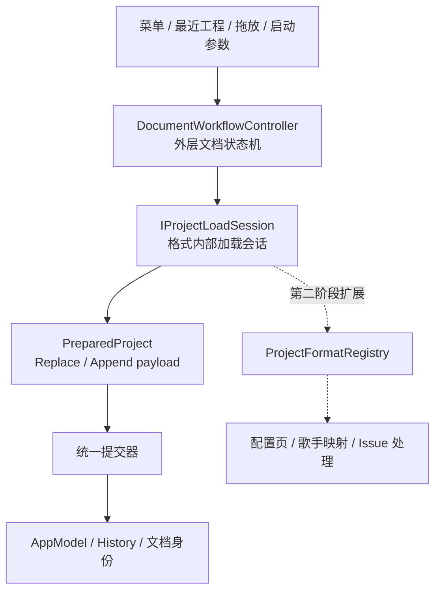

# 文档工作流与多格式导入两阶段改造方案

## 文档状态

| 阶段 | 状态 | 更新时间 |
| --- | --- | --- |
| 第一阶段：统一文档工作流 | 已完成 | 2026-07-15 |
| 第二阶段：通用多格式导入框架 | 待讨论 | 2026-07-15 |

本文记录 DS Editor Lite 的 New、Open、Import、Save、Save As、Close、Restart 工作流改造，
以及后续接入 DSPX Import、VSQX、USTX、SVP 等格式时的架构方向。

第一阶段代码已经完成并通过构建、自动化测试和人工回归。第二阶段仅作为下一轮讨论的基础，
其中的接口和交互策略尚未冻结。

DSPX 异步读取、Package metadata 等前置工作的历史背景见
[`async-project-loading-redesign-plan.md`](async-project-loading-redesign-plan.md)。

## 总体边界

整个设计分为两层：



- 外层状态机负责当前文档生命周期、保存保护、并发拒绝、终止和统一提交。
- 内层 Session 负责格式解析、格式专用配置、进度、取消和错误报告。
- 外层只接收 `ready / failed / canceled` 和 `PreparedProject`，不理解 MIDI 通道、编码或歌手映射。
- Session 和 Converter 不得修改当前文档、历史、路径或最近工程。
- 当前文档只能由统一提交器替换或追加。

# 第一阶段：统一文档工作流

## 目标与完成情况

第一阶段统一了现有文档操作，同时保留 DSPX 异步加载和 MIDI 同步配置能力：

- [x] New、Open、Import、Save、Save As 使用同一个外层状态机。
- [x] Close、Restart 进入相同的保存保护和 Session 取消流程。
- [x] 菜单、最近工程、拖放和启动参数统一提交请求。
- [x] DSPX 使用异步 Session，提交前旧工程保持不变。
- [x] MIDI 使用临时 Legacy Session，Open 固定替换、Import 固定追加。
- [x] Replace / Append 使用类型安全的 move-only payload。
- [x] AppModel 和 Track Action 使用明确所有权。
- [x] HistoryManager 支持 Saved / Unsaved 空历史基线。
- [x] MIDI Import 可以一次 Undo / Redo。
- [x] Dirty 文档关闭时，Save / Discard / Cancel 行为统一。
- [x] 使用 `ConditionalTransition` 表达同一事件的互斥守卫转移。

## 外层状态机

新增 `DocumentWorkflowController`，使用 Qt `QStateMachine` 管理以下状态：

- `Idle`
- `ValidatingRequest`
- `AwaitingSaveDecision`
- `AwaitingSavePath`
- `Saving`
- `StartingLoadSession`
- `RunningLoadSession`
- `Committing`
- `AwaitingSessionCancellation`
- `Failed`

公开请求：

```cpp
void requestNew();
void requestOpen(const QString &path);
void requestImport(const QString &path);
void requestSave();
void requestSaveAs();
void requestTermination(TerminationMode mode);
void cancelCurrentOperation();
```

当前规则：

- New、Open、Exit、Restart 在文档 Dirty 时进入保存保护。
- Import 不进入保存保护，因为它是对当前文档的追加编辑。
- 普通请求在非 Idle 状态被拒绝并显示 busy 提示。
- Exit / Restart 在 Session 运行时先取消 Session，再继续保存保护。
- `Committing` 不允许取消。
- Session 回调同时校验当前 Session 对象和 `requestId`，过期结果不得提交。
- 保存路径取消、保存保护取消、Session 取消都回到 Idle，当前文档保持不变。

### 守卫转移

状态机复用项目已有的 `ConditionalTransition`。副作用在状态入口完成，入口只写入结果枚举并发出
一个完成事件，多个互斥 guard 决定目标状态。

当前收敛后的完成事件为：

- `validationCompleted`
- `saveDecisionCompleted`
- `savePathSelectionCompleted`
- `saveCompleted`

例如 `validationCompleted` 根据 `ValidationResult` 转移到保存确认、Save As、Saving、
StartingLoadSession、Committing、Idle 或 Failed。

守卫必须保持纯读取：不得在 guard 中弹窗、保存文件、创建 Session 或修改模型。

Session 的 `ready / failed / canceled` 仍是不同语义事件，不为了统一形式而合并。

## Session 协议

第一阶段定义最小加载会话接口：

```cpp
class IProjectLoadSession : public QObject {
    Q_OBJECT

public:
    virtual void start() = 0;
    virtual void cancel() = 0;
    virtual PreparedProject takeResult() = 0;
    virtual quint64 requestId() const = 0;

signals:
    void progressChanged(const ProjectLoadProgress &progress);
    void ready();
    void failed(const ProjectOperationError &error);
    void canceled();
};
```

结果通过 `takeResult()` 移出，避免在 queued signal 中传递 move-only QObject 所有权：

```cpp
using PreparedProject =
    std::variant<std::monostate, ReplaceProjectPayload, AppendProjectPayload>;
```

- `ReplaceProjectPayload` 包含完整 `ProjectModelData`、LoopSettings、来源路径和来源类型。
- `AppendProjectPayload` 包含待追加的 ProjectModelData 和 tempo / time signature 导入选项。
- `ProjectModelData` 使用 `std::unique_ptr<Track>` 拥有尚未提交的轨道。
- 后台 Task 只返回不含 QObject 的解析结果；QObject 模型在主线程物化。

## DSPX Session

`DspxLoadSession` 接管了原 AppController 中的 DSPX 打开流程：

1. 等待 Package metadata Ready，或在扫描失败后询问是否降级打开。
2. 使用 `OpenDspxProjectTask` 分块读取并在后台解析。
3. 将 Task 状态映射为 `ProjectLoadProgress`。
4. 在主线程物化临时 AppModel，并执行音素 offset 规范化。
5. 生成 `ReplaceProjectPayload`。
6. 只有外层状态机进入 Committing 后才修改当前文档。

取消会立即关闭进度对话框、使请求失效并终止 Task。无法中断的后台残余工作完成后自行释放，
不得提交结果。

进度 UI 使用 `ProgressDialog(true, false, mainWindow)`，可取消、不可隐藏；进入提交阶段后禁用取消。

## MIDI Legacy Session

第一阶段的 `LegacyMidiLoadSession` 保留现有同步配置对话框和 Converter：

- Open MIDI 始终生成 Replace payload。
- Import MIDI 始终生成 Append payload。
- 删除“新轨道还是新工程”的二次模式选择。
- Open 默认勾选 tempo / time signature。
- Import 默认不勾选 tempo / time signature，用户可以主动开启。
- 配置取消返回 `canceled`；读取、转换或校验错误返回 `failed`。
- 修复非连续轨道选择在压缩后仍使用原始索引的问题。

MIDI 在第一阶段仍是同步解析。异步重解析、配置页抽象和歌手映射属于第二阶段。

## 统一提交

### Replace

Replace 的实际顺序：

1. Session 完成物化、校验和规范化。
2. 进入 Committing，禁用取消。
3. 清理旧历史及其拥有的已撤销对象。
4. `AppModel::replaceProject()` 原子替换模型。
5. 设置 loop。
6. 更新路径、名称、最近工程和最后目录。
7. 重置 Saved / Unsaved 历史基线。
8. 激活首个 Clip。

历史基线在 `modelChanged` 后再次建立，因为现有 UI 初始化过程中可能产生模型 Action；这样原生 DSPX
成功打开后不会错误显示未保存圆点。

文档身份规则：

- Open DSPX：保留 DSPX 路径、加入最近工程、应用文件 loop、标记 Saved。
- Open MIDI：路径为空、名称使用 MIDI 文件名、loop 重置、标记 Unsaved、不加入最近工程。
- New：空路径、默认名称、默认 loop、标记 Saved。

### Append

MIDI Import 使用名为 `Import MIDI` 的 `ActionSequence`：

- 可选 tempo 使用 TempoActions。
- 可选 time signature 使用 TimeSignatureActions。
- 所有 Track 插入属于同一历史记录。
- 一次 Undo / Redo 完整移除或恢复导入内容。
- 文档路径、名称、loop 和最近工程保持不变。
- 导入成功后激活第一个导入 Clip；没有 Clip 时保持当前活动项。

## 模型和历史所有权

新增和调整的模型接口：

```cpp
ProjectModelData AppModel::takeProjectData();
void AppModel::replaceProject(ProjectModelData &&data);
Track *AppModel::takeTrack(Track *track);
Track *AppModel::takeTrackAt(qsizetype index);
```

所有权规则：

- Track 在 AppModel 中时由 AppModel 拥有。
- Track 被撤销或移除后由对应 Action 的 `std::unique_ptr` 拥有。
- Action 析构只释放自身实际拥有的 Track。
- AppModel 析构和 `clearTracks()` 释放仍由模型拥有的 Track。
- RemoveTrackAction 记录原始索引，不再复制和重建完整 Track 列表。
- History reset 会释放 undo / redo 栈；记录新 Action 时会释放失效的 redo 栈。

HistoryManager 新增：

```cpp
enum class ResetState { Saved, Unsaved };
void reset(ResetState state = ResetState::Saved);
```

因此无路径的外来工程即使 undo 栈为空，也可以正确显示 Unsaved；保存成功后 `setSavePoint()`
清除 Unsaved 基线。

## UI 和终止流程

MainWindow 实现 `IDocumentWorkflowUi`，负责：

- 保存选择对话框。
- Save As 路径选择。
- Package 扫描失败确认。
- 错误提示和 busy 提示。

首次 `closeEvent` 始终忽略关闭并提交 `requestTermination(Exit)`。工作流批准终止后，使用
`QTimer::singleShot(0, ...)` 在下一轮事件循环重新关闭窗口，避免在状态机转移过程中同步嵌套
`closeEvent`，导致用户选择“不保存”后还需要关闭第二次。

批准后的第二次 close 进入现有 TaskManager 终止和等待流程。Restart 使用相同路径并携带
`TerminationMode::Restart`。

## 第一阶段验证记录

### 自动化

- Debug configure：通过。
- `DsEditorLite` Debug 构建：通过。
- CTest：2 / 2 通过。
  - `TestSpeakerMix`
  - `TestDocumentWorkflow`
- `TestDocumentWorkflow` 当前覆盖：
  - Saved / Unsaved 空历史基线。
  - `setSavePoint()`。
  - `Import MIDI` ActionSequence 的一次 Undo / Redo。
  - history reset 的 Action 所有权释放。
  - `ConditionalTransition` true / false guard 分流。

同时修复了既有 `TestSpeakerMix` 目标缺少 `MusicTimeConverter.cpp` 导致无法链接的问题。

### 人工回归

已使用 CLion Debug 和 Computer Use 验证：

- 两个慢 DSPX 工程均显示异步进度对话框并成功打开。
- DSPX 成功后标题、tempo、首 Clip 和 Saved 标记正确。
- 加载期间旧工程在提交前保持不变。
- DSPX 取消路径由用户验证可用。
- Open MIDI 默认导入 tempo / time signature，替换文档并显示 Unsaved。
- Import MIDI 默认不导入 tempo / time signature，文档身份和 tempo 保持不变。
- Import MIDI 可以一次 Undo / Redo。
- Dirty 工程关闭时选择 Cancel 会保留窗口。
- Dirty 工程关闭时选择 Discard 会在同一次关闭操作中退出。
- 测试过程中未保存或修改两个本地 DSPX 性能样本。

### 尚未形成自动化覆盖的路径

以下路径由状态机实现支持，但尚未加入完整的假 UI / 假 Session 自动化矩阵：

- 保存失败后的重试、放弃和取消。
- Restart 全流程。
- 人工注入旧 requestId 的 Session 信号。
- DSPX Package Error 降级确认。
- Track Action 的 sanitizer / 泄漏检测。

这些不阻塞第一阶段功能交付，但后续修改外层状态机时应优先补充。

# 第二阶段：通用多格式导入框架

## 状态

第二阶段尚未实施。本节用于新对话中讨论和修订，不代表接口已经冻结。

## 目标

在不破坏第一阶段外层工作流和统一提交器的前提下，将 DSPX / MIDI 临时 Session 扩展为支持：

- DSPX Import
- VSQX
- USTX
- SVP
- 后续其他歌声合成工程格式

重点解决：

- 格式发现与能力声明。
- 格式专用后台解析。
- 动态导入设置和重新分析。
- 轨道、通道、字符编码和歌词预览。
- 歌手、声库和资源映射。
- 时间线冲突解决。
- Warning、可恢复错误和致命错误。

## 格式注册方向

预期引入 `ProjectFormatRegistry` 和 Handler：

```cpp
struct ProjectFormatDescriptor {
    QString id;
    QString displayName;
    QStringList extensions;
    bool canOpen;
    bool canImport;
    bool canExport;
};

class IProjectFormatHandler {
public:
    virtual ProjectFormatDescriptor descriptor() const = 0;
    virtual bool probe(const QByteArray &header) const = 0;
    virtual IProjectLoadSession *createSession(
        const ProjectLoadRequest &request,
        QObject *parent) = 0;
};
```

候选实现：

- `DspxFormatHandler`
- `MidiFormatHandler`
- `VsqxFormatHandler`
- `UstxFormatHandler`
- `SvpFormatHandler`

格式识别采用扩展名初筛加文件头 probe，不完全依赖扩展名。

## 内部 Session 状态机方向

每个格式 Session 预期复用通用内部状态骨架：

- `Probing`
- `Reading`
- `Parsing`
- `Inspecting`
- `AwaitingConfiguration`
- `Reprocessing`
- `ResolvingResources`
- `AwaitingResolution`
- `Validating`
- `Materializing`
- `Ready`
- `Failed`
- `Canceled`

规则方向：

- 配置项是 Session Context 数据，不为每个选项创建状态。
- 配置改变需要重解析时，从 AwaitingConfiguration 进入 Reprocessing。
- 异步重解析使用 `generationId` 丢弃旧结果。
- 歌手映射和冲突处理进入 AwaitingResolution。
- Materializing 前原则上允许取消。
- 内部 Session 最终仍只输出 PreparedProject，不修改当前文档。
- 合适的互斥分支继续使用 `ConditionalTransition`，守卫不承担副作用。

## 配置 UI 方向

初步方向是“通用导入向导容器 + Handler 提供格式专用页面”：

- MIDI：轨道 / 通道、编码、歌词预览。
- 歌声工程格式：轨道选择、歌手映射、资源缺失。
- 通用页面：时间线冲突、Warning 摘要、最终确认。
- Session 只接收配置 DTO，不持有 QWidget。

预期输入类型包括：

- `TrackSelection`
- `ChannelSelection`
- `TextEncoding`
- `LyricsPreview`
- `SingerMapping`
- `ResourceMapping`
- `TimelineConflict`
- `WarningConfirmation`

## Issue 模型方向

预期增加统一 Issue 严重程度：

```cpp
enum class ProjectIssueSeverity {
    Information,
    Warning,
    RecoverableError,
    FatalError,
};
```

`ProjectIssue` 至少包含稳定 code、用户消息、来源位置和可选解决方式。

- Information：仅记录。
- Warning：允许继续，在最终确认页汇总。
- RecoverableError：进入 AwaitingResolution，例如缺失歌手或资源。
- FatalError：Session 失败，旧工程保持不变。
- Parser / Converter 不直接弹窗。
- 保存和提交错误继续由外层工作流处理。

## 建议迁移顺序

1. 用 `MidiFormatHandler` 替换 `LegacyMidiLoadSession`，拆分后台解析、配置和物化。
2. MIDI 通道切换改为异步 Reprocessing，并用 generationId 丢弃旧结果。
3. 引入通用导入向导和基础 UserInput DTO。
4. 实现 DSPX Import：轨道选择、时间线选项和 loop 忽略策略。
5. 引入 SingerMapping 和 ResourceMapping。
6. 将 DSPX Open 迁入格式注册表，移除第一阶段临时 Session 工厂。
7. 接入至少一种新的歌声工程格式，用第三种实现验证抽象。
8. 根据第三种格式暴露的问题，再冻结 Handler、配置页和 Issue API。

## 下一轮需要优先讨论的问题

1. 配置页接口、生命周期及前后导航如何建模？
2. 配置变化引发重解析时，哪些中间结果可以复用？
3. SingerMapping 按 singer、track 还是 clip 建模？
4. 歌手映射规则是否持久化，如何避免错误自动复用？
5. Import 时 tempo / time signature / loop 冲突如何统一表达？
6. 无法识别的参数、自动化曲线和资源如何降级？
7. RecoverableError 的标准动作是否统一为 Retry / Skip / Map / Abort？
8. 跳过错误 Track / Clip 后如何保证 payload 完整性？
9. Warning 是否支持“不再提示”，作用域是什么？
10. Materializing 阶段的取消边界和原子性如何定义？

## 第二阶段验收方向

- Registry 的扩展名和文件头识别优先级。
- Handler 的 Open / Import 能力限制。
- 配置取消、返回修改和重新分析。
- 多次异步 Reprocessing 只接受最新 generation。
- 歌手映射完成、跳过、失败和持久化复用。
- Warning 继续、RecoverableError 修复、FatalError 终止。
- DSPX Import 不覆盖路径和 loop。
- 不同格式统一生成 Replace / Append payload。
- 任意内部失败、取消或过期结果均不修改当前工程。
- 使用 MIDI、DSPX 和至少一种新增格式验证抽象，而不是只依靠模拟实现。

## 保持不变的约束

- 第一阶段的外层文档请求接口保持稳定。
- PreparedProject 和统一提交器仍是内外层边界。
- Import 是追加编辑，默认不改变文档身份和 loop。
- 普通并发请求继续拒绝，不自动排队或替换。
- 第二阶段可以扩展内部 Session 协议，但不能让 Handler 直接修改全局 AppModel、History 或路径。
