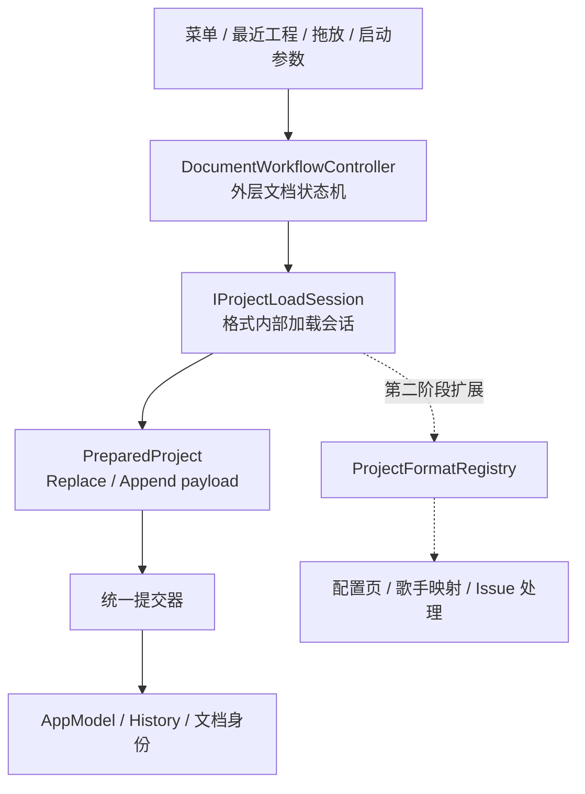

# 文档工作流与多格式导入两阶段改造方案

## 文档状态

| 阶段 | 状态 | 更新时间 |
| --- | --- | --- |
| 第一阶段：统一文档工作流 | 已完成（2026-08-08 复核并补充实现细节） | 2026-07-15 |
| 第二阶段：通用多格式导入框架 | 实施中（迁移顺序第 1-4 步已完成） | 2026-08-08 |

本文记录 DS Editor Lite 的 New、Open、Import、Save、Save As、Close、Restart 工作流改造，
以及后续接入 DSPX Import、VSQX、USTX、SVP 等格式时的架构方向。

第一阶段代码已经完成并通过构建、自动化测试和人工回归。第二阶段仅作为下一轮讨论的基础，
其中的接口和交互策略尚未冻结。

DSPX 异步读取、Package metadata 等前置工作的历史背景见
[异步工程加载 — 设计文档](../design/async-project-loading-design.md)。

## 总体边界

整个设计分为两层：



- 外层状态机负责当前文档生命周期、保存保护、并发拒绝、终止和统一提交。
- 内层 Session 负责格式解析、格式专用配置、进度、取消和错误报告。
- 外层只接收 `ready / failed / canceled` 和 `PreparedProject`，不理解 MIDI 通道、编码或歌手映射。
- Session 和 Converter 不得修改当前文档、历史、路径或最近工程。
- 当前文档只能由统一提交器替换或追加。

# 第一阶段：统一文档工作流

## 目标与完成情况

第一阶段统一了现有文档操作，同时保留 DSPX 异步加载和 MIDI 同步配置能力：

- [x] New、Open、Import、Save、Save As 使用同一个外层状态机。
- [x] Close、Restart 进入相同的保存保护和 Session 取消流程。
- [x] 菜单、最近工程、拖放和启动参数统一提交请求。
- [x] DSPX 使用异步 Session，提交前旧工程保持不变。
- [x] MIDI 使用临时 Legacy Session，Open 固定替换、Import 固定追加。
- [x] Replace / Append 使用类型安全的 move-only payload。
- [x] AppModel 和 Track Action 使用明确所有权。
- [x] HistoryManager 支持 Saved / Unsaved 空历史基线。
- [x] MIDI Import 可以一次 Undo / Redo。
- [x] Dirty 文档关闭时，Save / Discard / Cancel 行为统一。
- [x] 使用 `ConditionalTransition` 表达同一事件的互斥守卫转移。

## 外层状态机

新增 `DocumentWorkflowController`，使用 Qt `QStateMachine` 管理以下状态：

- `Idle`
- `ValidatingRequest`
- `AwaitingSaveDecision`
- `AwaitingSavePath`
- `Saving`
- `StartingLoadSession`
- `RunningLoadSession`
- `Committing`
- `AwaitingSessionCancellation`
- `Failed`

公开请求：

```cpp
void requestNew();
void requestOpen(const QString &path);
void requestImport(const QString &path);
void requestSave();
void requestSaveAs();
void requestTermination(TerminationMode mode);
void cancelCurrentOperation();
```

当前规则：

- New、Open、Exit、Restart 在文档 Dirty 时进入保存保护。
- Import 不进入保存保护，因为它是对当前文档的追加编辑。
- 普通请求在非 Idle 状态被拒绝并显示 busy 提示。
- Exit / Restart 在 Session 运行时先取消 Session，再继续保存保护。
- `Committing` 不允许取消。
- Session 回调同时校验当前 Session 对象和 `requestId`，过期结果不得提交。
- 保存路径取消、保存保护取消、Session 取消都回到 Idle，当前文档保持不变。

### 守卫转移

状态机复用项目已有的 `ConditionalTransition`。副作用在状态入口完成，入口只写入结果枚举并发出
一个完成事件，多个互斥 guard 决定目标状态。

当前收敛后的完成事件为：

- `validationCompleted`
- `saveDecisionCompleted`
- `savePathSelectionCompleted`
- `saveCompleted`

例如 `validationCompleted` 根据 `ValidationResult` 转移到保存确认、Save As、Saving、
StartingLoadSession、Committing、Idle 或 Failed。

守卫必须保持纯读取：不得在 guard 中弹窗、保存文件、创建 Session 或修改模型。

Session 的 `ready / failed / canceled` 仍是不同语义事件，不为了统一形式而合并。

## Session 协议

第一阶段定义最小加载会话接口：

```cpp
class IProjectLoadSession : public QObject {
    Q_OBJECT

public:
    virtual void start() = 0;
    virtual void cancel() = 0;
    virtual PreparedProject takeResult() = 0;
    virtual quint64 requestId() const = 0;

signals:
    void progressChanged(const ProjectLoadProgress &progress);
    void ready();
    void failed(const ProjectOperationError &error);
    void canceled();
};
```

结果通过 `takeResult()` 移出，避免在 queued signal 中传递 move-only QObject 所有权：

```cpp
using PreparedProject =
    std::variant<std::monostate, ReplaceProjectPayload, AppendProjectPayload>;
```

- `ReplaceProjectPayload` 包含完整 `ProjectModelData`、LoopSettings、来源路径和来源类型。
- `AppendProjectPayload` 包含待追加的 ProjectModelData 和 tempo / time signature 导入选项。
- `ProjectModelData` 使用 `std::unique_ptr<Track>` 拥有尚未提交的轨道。
- 后台 Task 只返回不含 QObject 的解析结果；QObject 模型在主线程物化。

## DSPX Session

`DspxLoadSession` 接管了原 AppController 中的 DSPX 打开流程：

1. 等待 Package metadata Ready，或在扫描失败后询问是否降级打开。
2. 使用 `OpenDspxProjectTask` 分块读取并在后台解析。
3. 将 Task 状态映射为 `ProjectLoadProgress`。
4. 在主线程物化临时 AppModel，并执行音素 offset 规范化。
5. 生成 `ReplaceProjectPayload`。
6. 只有外层状态机进入 Committing 后才修改当前文档。

取消会立即关闭进度对话框、使请求失效并终止 Task。无法中断的后台残余工作完成后自行释放，
不得提交结果。

进度 UI 使用 `ProgressDialog(true, false, mainWindow)`，可取消、不可隐藏；进入提交阶段后禁用取消。

## MIDI Legacy Session

第一阶段的 `LegacyMidiLoadSession` 保留现有同步配置对话框和 Converter：

- Open MIDI 始终生成 Replace payload。
- Import MIDI 始终生成 Append payload。
- 删除“新轨道还是新工程”的二次模式选择。
- Open 默认勾选 tempo / time signature。
- Import 默认不勾选 tempo / time signature，用户可以主动开启。
- 配置取消返回 `canceled`；读取、转换或校验错误返回 `failed`。
- 修复非连续轨道选择在压缩后仍使用原始索引的问题。

MIDI 在第一阶段仍是同步解析。异步重解析、配置页抽象和歌手映射属于第二阶段。

## 统一提交

### Replace

Replace 的实际顺序：

1. Session 完成物化、校验和规范化。
2. 进入 Committing，禁用取消。
3. 清理旧历史及其拥有的已撤销对象。
4. `AppModel::replaceProject()` 原子替换模型。
5. 设置 loop。
6. 更新路径、名称、最近工程和最后目录。
7. 重置 Saved / Unsaved 历史基线。
8. 激活首个 Clip。

历史基线在 `modelChanged` 后再次建立，因为现有 UI 初始化过程中可能产生模型 Action；这样原生 DSPX
成功打开后不会错误显示未保存圆点。

文档身份规则：

- Open DSPX：保留 DSPX 路径、加入最近工程、应用文件 loop、标记 Saved。
- Open MIDI：路径为空、名称使用 MIDI 文件名、loop 重置、标记 Unsaved、不加入最近工程。
- New：空路径、默认名称、默认 loop、标记 Saved。

### Append

MIDI Import 使用 `ImportProjectActions`（`ActionSequence` 子类，
`src/app/Controller/Actions/AppModel/ImportProjectActions.h`）：

- 可选 tempo 使用 TempoActions。
- 可选 time signature 使用 TimeSignatureActions。
- 所有 Track 插入属于同一历史记录。
- 一次 Undo / Redo 完整移除或恢复导入内容。
- 文档路径、名称、loop 和最近工程保持不变。
- 导入成功后激活第一个导入 Clip；没有 Clip 时保持当前活动项。

## 模型和历史所有权

新增和调整的模型接口：

```cpp
ProjectModelData AppModel::takeProjectData();
void AppModel::replaceProject(ProjectModelData &&data);
Track *AppModel::takeTrack(Track *track);
Track *AppModel::takeTrackAt(qsizetype index);
```

所有权规则：

- Track 在 AppModel 中时由 AppModel 拥有。
- Track 被撤销或移除后由对应 Action 的 `std::unique_ptr` 拥有。
- Action 析构只释放自身实际拥有的 Track。
- AppModel 析构和 `clearTracks()` 释放仍由模型拥有的 Track。
- RemoveTrackAction 记录原始索引，不再复制和重建完整 Track 列表。
- History reset 会释放 undo / redo 栈；记录新 Action 时会释放失效的 redo 栈。

HistoryManager 新增：

```cpp
enum class ResetState { Saved, Unsaved };
void reset(ResetState state = ResetState::Saved);
```

因此无路径的外来工程即使 undo 栈为空，也可以正确显示 Unsaved；保存成功后 `setSavePoint()`
清除 Unsaved 基线。

## UI 和终止流程

MainWindow 实现 `IDocumentWorkflowUi`，负责：

- 保存选择对话框。
- Save As 路径选择。
- Package 扫描失败确认。
- 错误提示和 busy 提示。

首次 `closeEvent` 始终忽略关闭并提交 `requestTermination(Exit)`。工作流批准终止后，使用
`QTimer::singleShot(0, ...)` 在下一轮事件循环重新关闭窗口，避免在状态机转移过程中同步嵌套
`closeEvent`，导致用户选择“不保存”后还需要关闭第二次。

批准后的第二次 close 进入现有 TaskManager 终止和等待流程。Restart 使用相同路径并携带
`TerminationMode::Restart`。

## 批量导入与拖放并行管线（2026-08 补充）

文档创建后新增了独立的批量导入管线（`f8b70a5b`），与上方外层状态机**并行存在**：

- `DocumentImportController`（`src/app/Modules/Import/`）接收批量文件列表（多选 / 拖放），串行准备后由 `BatchImportActions`（`ActionSequence` 子类）**直接提交**并 `historyManager->record()`。
- 该管线**不经过外层状态机**：没有保存保护、并发拒绝、requestId 校验和统一提交器；遵守追加语义（不改文档身份、路径、loop 和最近工程）。
- 因此"菜单、最近工程、拖放和启动参数统一提交请求"目前只对**单文件入口**成立；批量 / 拖放走轻量管线。
- 第二阶段迁移顺序第 1 步（`MidiFormatHandler` 替换 `LegacyMidiLoadSession`）时应评估是否将批量管线一并纳入格式注册表。

## 文档创建后的实现补充（2026-08-08 复核）

- `ReplaceProjectPayload::displayName`：外来工程的显示名（`71e3cfa6` 修复带点外来文件名在标题中丢失的问题）。
- `m_skipSaveGuard`：用户选择 Discard 或保存后 resume 时跳过重复的保存保护询问。
- 枚举：`DocumentOperation { New, Open, Import, Save, SaveAs }`、`ProjectLoadPurpose { Open, Import }`、`ProjectSourceKind { Native, Foreign }`。
- 信号：`busyChanged` / `documentIdentityChanged` / `recentProjectFilesChanged` / `terminationApproved`；完成事件除文档列出的 4 个外还有 `sessionStarted` / `sessionReadyEvent` / `sessionFailedEvent` / `sessionCanceledEvent` / `cancelSessionRequested` / `commitFinished` / `failureHandled` / `operationFailed`。
- `initializeNewDocument()`：启动时创建默认文档的入口。
- 状态命名：文档中的 `AwaitingSessionCancellation` 对应代码 `m_cancelingSessionState`。
- 进度对话框父窗口：`ensureProgressDialog` 使用 `m_ui->documentWorkflowParentWidget()` 作为 parent（`ProgressDialog(true, false, ...)` 可取消、不可隐藏）。
- 相关后续修复：`f184dde5`（Restart 不再把 exe 路径当工程打开）、`b844644f`（未保存时 Windows 关机拦截自定义文案）。

## 第一阶段验证记录

### 自动化

- Debug configure：通过。
- `DsEditorLite` Debug 构建：通过。
- CTest：2 / 2 通过。
  - `TestSpeakerMix`
  - `TestDocumentWorkflow`
- `TestDocumentWorkflow` 当前覆盖：
  - Saved / Unsaved 空历史基线。
  - `setSavePoint()`。
  - `Import MIDI` ActionSequence 的一次 Undo / Redo。
  - history reset 的 Action 所有权释放。
  - `ConditionalTransition` true / false guard 分流。

同时修复了既有 `TestSpeakerMix` 目标缺少 `MusicTimeConverter.cpp` 导致无法链接的问题。

### 人工回归

已使用 CLion Debug 和 Computer Use 验证：

- 两个慢 DSPX 工程均显示异步进度对话框并成功打开。
- DSPX 成功后标题、tempo、首 Clip 和 Saved 标记正确。
- 加载期间旧工程在提交前保持不变。
- DSPX 取消路径由用户验证可用。
- Open MIDI 默认导入 tempo / time signature，替换文档并显示 Unsaved。
- Import MIDI 默认不导入 tempo / time signature，文档身份和 tempo 保持不变。
- Import MIDI 可以一次 Undo / Redo。
- Dirty 工程关闭时选择 Cancel 会保留窗口。
- Dirty 工程关闭时选择 Discard 会在同一次关闭操作中退出。
- 测试过程中未保存或修改两个本地 DSPX 性能样本。

### 尚未形成自动化覆盖的路径

以下路径由状态机实现支持，但尚未加入完整的假 UI / 假 Session 自动化矩阵：

- 保存失败后的重试、放弃和取消。
- Restart 全流程。
- 人工注入旧 requestId 的 Session 信号。
- DSPX Package Error 降级确认。
- Track Action 的 sanitizer / 泄漏检测。

这些不阻塞第一阶段功能交付，但后续修改外层状态机时应优先补充。

# 第二阶段：通用多格式导入框架

## 状态

第二阶段自 2026-08-08 起按"建议迁移顺序"逐步实施。接口以实际代码为准，本节保留讨论记录。

### 实施进度

| 步骤 | 内容 | 状态 |
| --- | --- | --- |
| 1 | `MidiFormatHandler` 替换 `LegacyMidiLoadSession`（拆分后台解析 / 配置 / 物化） | ✅ `6422a524` |
| 2 | MIDI 通道切换改为异步 Reprocessing，用 generationId 丢弃旧结果 | ✅ `f007c139` |
| 3 | 引入通用导入向导和基础 UserInput DTO | ✅ `d970f22a` |
| 4 | 实现 DSPX Import（轨道选择、时间线选项、loop 忽略策略） | ✅（2026-08-08） |
| 5 | 引入 SingerMapping 和 ResourceMapping | ⬜（2026-08-08 暂缓，先不做） |
| 6 | DSPX Open 迁入格式注册表 + Session 骨架重构（流程基类 / 配置解耦） | ✅（2026-08-08） |
| 7 | 接入 LibreSVIP 转换器：外部进程 + DSPX 中间表示（stdio MVP，Open + Import） | ✅（2026-08-08） |
| 8 | 冻结 Handler、配置页和 Issue API（LibreSVIP 接入完成后） | ⬜ |

第 1 步落地内容（2026-08-08）：

- 新增 `src/app/Modules/ProjectFormats/`：`IProjectFormatHandler`（`descriptor / probe / createSession`，请求为 `ProjectLoadRequest { filePath, purpose, requestId }`）、`ProjectFormatRegistry`（LITE_SINGLETON，构造时内置注册内置格式，`resolveByPath` 按扩展名解析）、`MidiFormatHandler`（`.mid` / `.midi`，probe 为 `MThd` 文件头）。
- 新增 `Controller/Tasks/MidiParseTask`：`MidiFileParser` 移入后台 Task（`isTerminateRequested` 可中断）。
- 新增 `Controller/DocumentWorkflow/MidiLoadSession` 替代 `LegacyMidiLoadSession`：后台解析 → 交互配置（Open 默认勾选 tempo/拍号，Import 默认不勾）→ 物化（临时 AppModel + 音素 offset 规范化）→ Replace / Append payload。用户可见行为与原同步流程一致。
- `DocumentWorkflowController::createSession`：MIDI 经注册表创建 Session；DSPX Open 保持专用路径（步骤 6 迁移）。
- 接口小改：`MidiConverterUi` 三个配置方法 protected → public；`buildTrackInfoList` 公开为 `buildMidiTrackInfoList`（`MidiConverter.h`）。
- 修复 `a627df39`：追加提交时重置导入轨道颜色——payload 轨道在临时模型上已被分配色轮色，`AppModel::insertTrack` 只对 `colorIndex()==0` 的轨道重新分配，导致前两条轨道颜色重复；`commitAppend` 统一重置后由 `insertTrack` 基于真实模型重新分配，颜色序列恢复递增。该 bug 为既有问题（旧同步流程同样经过临时模型），拖放导入路径不受影响（轨道未经过临时模型）。

验证：Debug 构建通过；ctest 18/19 通过（`TestAnimationSettings` 为既有失败，与导入无关）；人工验证 Open / Import / 拖放导入与色轮递增均正常。

第 2 步落地内容（2026-08-08，`f007c139`）：

- 新增 `Controller/Tasks/MidiReprocessTask`：rawData + separateChannels → 后台重新转换 + 重建轨道列表（`buildMidiTrackInfoList`）。
- `MidiLoadSession` 直接驱动 `MidiConverterDialog`（替代经 `MidiConverterUi::chooseImportOptions` 的同步接线）：对话框切换"分离 MIDI 通道" → `requestReprocess`（终止旧任务、`m_reprocessGeneration++`）→ 后台任务完成后经 generationId 校验，仅最新结果更新 `m_parseData.mediate` 并回写对话框轨道列表 + 重新检测编码；过期/终止任务的结果直接丢弃。重解析失败时保留上一个有效轨道列表，不阻塞导入。
- 移除 `MidiTrackReconverterImpl`（同步 reconvert 路径）；libs 的 `MidiConverter::loadInteractive` 同步路径原样保留（app 侧已无调用者）。
- 与第一阶段约束一致：物化仍使用最终 `m_parseData.mediate`（含最后一次通道切换的结果），对话框关闭/取消后到达的过期结果不影响已定型的 payload。

验证：Debug 构建通过；`TestDocumentWorkflow` / `TestSpeakerMix` / `TestSpeakerMixValidation` 通过。


第 3 步落地内容（2026-08-08）：

- 新增 `src/app/Modules/ProjectFormats/UserInput.h`：基础 UserInput DTO——`TextEncodingInput` / `TrackSelectionInput` / `ChannelSeparationInput` / `TimelineOptionsInput`，以及 MIDI 汇总 `MidiUserInput`。
- 新增 `src/app/Modules/ProjectFormats/IProjectConfigPage.h`：配置页接口（`widget()`）。
- 新增 `src/app/Modules/ProjectFormats/ProjectImportConfigDialog`：通用单页配置容器（内容区 + OK/Cancel），`setPage()` 注入格式页面。
- 新增 `src/app/Modules/ProjectConverters/MidiConfigPage`：`MidiConverterDialog` 的 body 整体迁出（轨道选择 / 全选 / 编码 / 歌词预览 / 选项），新增 `collectInput() -> MidiUserInput`；`MidiConverterDialog` 收缩为薄壳（内部托管 `MidiConfigPage`，保留给 libs 同步路径 `MidiConverterUi::chooseImportOptions`）。
- `IProjectFormatHandler` 新增 `createConfigPage(QWidget*)`；`MidiFormatHandler` 返回 `MidiConfigPage`。
- `MidiLoadSession` 不再依赖 `MidiConverterDialog`：经 Handler 获取配置页注入通用容器，确认后只消费 `MidiUserInput` 物化；通道切换 reprocess 信号与结果回写（`setTrackInfoList` / `detectCodec`）改经 `MidiConfigPage`。Session 对格式专用 UI 类零依赖。

验证：Debug 构建通过；`TestDocumentWorkflow` / `TestSpeakerMix` / `TestSpeakerMixValidation` 通过。待人工验证：Open / Import MIDI 配置对话框交互与第 2 步一致（含通道切换异步重解析）。

第 4 步落地内容（2026-08-08）：

- 新增 `src/app/Modules/ProjectFormats/DspxFormatHandler`：`.dspx` 扩展名、zip 文件头 probe、`createSession` 仅接受 Import（DSPX Open 保持专用路径，步骤 6 迁移）、`createConfigPage` 返回 `DspxConfigPage`。
- 新增 `src/app/Modules/ProjectConverters/DspxConfigPage`：轨道选择器（Name / Type / Notes 三列 + Select All，Type 为 Singing / Audio / Mixed / Empty）+ 时间线选项；`collectInput() -> DspxUserInput`（复用 `MidiImportTrackInfo` 作为通用轨道展示记录，`rangeText` 承载轨道类型）。
- 新增 `src/app/Controller/DocumentWorkflow/DspxImportLoadSession`：解析复用 `OpenDspxProjectTask`（无 Package 等待——singer 引用以 identifier 传递，不查包）；配置经通用容器；物化 = 拷贝 `opendspx::Model` → 丢弃未选轨道 → **基类 `DspxProjectConverter`**（非 Ui 子类，loop 不推 AppStatus，实现"Import 永不触碰 loop"）→ `AppendProjectPayload`。
- `ProjectFormatRegistry` 注册 `DspxFormatHandler`（扩展名命中后 `createSession` 按 purpose 分派，Open 返回 nullptr 由外层专用路径兜底）。
- `UserInput.h` 新增 `DspxUserInput { TrackSelectionInput, TimelineOptionsInput }`。

验证：Debug 构建通过；`TestDocumentWorkflow` / `TestSpeakerMix` / `TestSpeakerMixValidation` 通过。待人工验证：DSPX Import 轨道选择 / tempo / 拍号 / loop 忽略 / 一次撤销。

补充：导入菜单新增「DiffScope project file...」入口（`MainMenuView`，单文件对话框 `*.dspx` → `requestImport`）；批量导入管线仍为 MIDI 专用，DSPX 暂走单文件交互路径。
补充：`validatePendingRequest` 的硬编码格式白名单改为从 `ProjectFormatRegistry` 派生（Open = dspx 专用路径 ∪ registry 命中；Import = registry 命中且 `canImport`），新格式注册后校验自动生效。

第 6 步落地内容（2026-08-08）：

- **S6a 骨架化**：新增 `Controller/DocumentWorkflow/ProjectLoadSessionBase`——start / cancel / terminal 状态机、主解析任务生命周期（`createParseTask` / `handleParseResult` 钩子）、可选重解析（`requestReprocess` + generationId 丢弃过期结果，`createReprocessTask` / `handleReprocessResult` 钩子）、进度发布（`shouldPublishProgress` 控制，MIDI 不发布保持原行为）、`finishWithResult` / `fail` / `emitCanceled` 结果交接。
- **S6b 配置解耦**：`MidiLoadSession` / `DspxImportLoadSession` 不再持有具体配置页类型成员（`MidiConfigPage*` / `DspxConfigPage*` → 仅 `IProjectConfigPage*` 生命周期引用或局部变量）；配置内容与交互仍 100% 格式专属（MIDI 编码预览 / 通道分离重解析、DSPX 轨道选择各自实现）。
- **S6c DSPX Open 入注册表**：`IProjectFormatHandler::createSession` 增加 `IDocumentWorkflowUi*` 参数（交互会话确认框用）；`DspxFormatHandler` 声明 `canOpen`，按 purpose 分派（Open → `DspxLoadSession`，Import → `DspxImportLoadSession`）；`DocumentWorkflowController` 删除 dspx 专用分支与硬编码白名单（Open 改 `canOpen` 派生），`DspxLoadSession` 由 Handler 创建。
- 三个既有 Session（`MidiLoadSession` / `DspxImportLoadSession` / `DspxLoadSession`）净减约 370 行样板；`DspxImportLoadSession` 保留显式析构（`unique_ptr<opendspx::Model>` 前向声明，析构需在类型完整处定义）。

验证：Debug 构建通过（重新 configure 拾取新源文件）；ctest 18/19（`TestAnimationSettings` 为既有失败）；`TestDocumentWorkflow` / `TestSpeakerMix` / `TestSpeakerMixValidation` 通过。待人工验证：Open / Import DSPX、MIDI Open / Import、MIDI 编码预览与通道重解析回归。

第 7 步落地内容（2026-08-08，stdio MVP）：

- 新增 `Controller/Tasks/LibreSVIPConvertTask`：QProcess 启动 `libresvip-cli proj convert <in> <临时.dspx>`，stdin 喂 40 行默认应答覆盖任意格式的交互问答；输出为 zstd 压缩 DSPX JSON，复用 `DspxProjectParser::parse`（opendspx 自动解压，vcpkg 1ea5b75c 与 libresvip 2.8.1 兼容已实测）。
- 新增 `Controller/DocumentWorkflow/OpendspxImportLoadSession` 基类：DSPX 与桥接格式共享的配置（`DspxConfigPage` 轨道选择）与物化（基类 `DspxProjectConverter` Append；`purpose == Open` 时改用 `DspxProjectConverterUi` NewProject + `ReplaceProjectPayload`，loop 进 AppStatus）；子类只实现 `createParseTask` / `takeParsedModel` 钩子。
- 新增 `LibreSVIPLoadSession`（~30 行，parse = 转换 task）+ `Modules/ProjectFormats/LibreSVIPFormatHandler`（36 个扩展名，排除 mid/midi/dspx 与泛 .xml；`canOpen` / `canImport`；配置页复用 `DspxConfigPage`）。
- libresvip 路径配置沿用 AppOptions：`GeneralOption::libreSVIPPath`（与 `rmvpePath` 同款 `LITE_OPTION_ITEM`）+ `GeneralPage` 的 Model 卡片 FileSelector；解析器读取顺序 = AppOptions → PATH 兜底。
- UI 入口：导入菜单新增「Project file (LibreSVIP)...」（扩展名从 registry 派生）；文件 → 打开对话框过滤器改为 registry `canOpen` 动态派生（桥接扩展名自动可见）。
- libresvip-cli 获取：DiffScope catalog（catalogs.diffscope.org/3rdparty/libresvip/index.json）→ GitHub release（SoulMelody/LibreSVIP）v2.8.1 win-amd64，本机部署于 `D:\GitRepos\libresvip\libresvip-cli\`。

验证：Debug 构建通过；ctest 无回归；人工验证（用户 2026-08-08 实测）文件 → 打开 USTX 正常（轨道选择 → Replace），导入入口可用。已知限制：格式选项全默认（stdio 问答无 GUI）；libresvip 每次启动约 5-6s（Python 打包）；转换警告未展示；`OpendspxImportLoadSession` 等新翻译 context 待 i18n 更新。

## 目标

在不破坏第一阶段外层工作流和统一提交器的前提下，将 DSPX / MIDI 临时 Session 扩展为支持：

- DSPX Import
- VSQX
- USTX
- SVP
- 后续其他歌声合成工程格式

> **2026-08-08 路线调整**：VSQX / USTX / SVP 等外部格式不再自研解析器，改为接入 LibreSVIP 转换器
> （参考 DiffScope 架构）：libresvip 外部进程负责解析任意格式并输出 DSPX 二进制，编辑器复用现有
> opendspx 解析链路消费。SVP 已在 libresvip 支持列表（svp / ustx / vsqx / vspx / svip 等 30+ 格式），无需逆向。

重点解决：

- 格式发现与能力声明。
- 格式专用后台解析。
- 动态导入设置和重新分析。
- 轨道、通道、字符编码和歌词预览。
- 歌手、声库和资源映射。
- 时间线冲突解决。
- Warning、可恢复错误和致命错误。

## 格式注册方向

预期引入 `ProjectFormatRegistry` 和 Handler：

```cpp
struct ProjectFormatDescriptor {
    QString id;
    QString displayName;
    QStringList extensions;
    bool canOpen;
    bool canImport;
    bool canExport;
};

class IProjectFormatHandler {
public:
    virtual ProjectFormatDescriptor descriptor() const = 0;
    virtual bool probe(const QByteArray &header) const = 0;
    virtual IProjectLoadSession *createSession(
        const ProjectLoadRequest &request,
        QObject *parent) = 0;
};
```

候选实现：

- `DspxFormatHandler`
- `MidiFormatHandler`
- `VsqxFormatHandler`
- `UstxFormatHandler`
- `SvpFormatHandler`

格式识别采用扩展名初筛加文件头 probe，不完全依赖扩展名。

## 内部 Session 状态机方向

每个格式 Session 预期复用通用内部状态骨架：

- `Probing`
- `Reading`
- `Parsing`
- `Inspecting`
- `AwaitingConfiguration`
- `Reprocessing`
- `ResolvingResources`
- `AwaitingResolution`
- `Validating`
- `Materializing`
- `Ready`
- `Failed`
- `Canceled`

规则方向：

- 配置项是 Session Context 数据，不为每个选项创建状态。
- 配置改变需要重解析时，从 AwaitingConfiguration 进入 Reprocessing。
- 异步重解析使用 `generationId` 丢弃旧结果。
- 歌手映射和冲突处理进入 AwaitingResolution。
- Materializing 前原则上允许取消。
- 内部 Session 最终仍只输出 PreparedProject，不修改当前文档。
- 合适的互斥分支继续使用 `ConditionalTransition`，守卫不承担副作用。

## 配置 UI 方向

初步方向是“通用导入向导容器 + Handler 提供格式专用页面”：

- MIDI：轨道 / 通道、编码、歌词预览。
- 歌声工程格式：轨道选择、歌手映射、资源缺失。
- 通用页面：时间线冲突、Warning 摘要、最终确认。
- Session 只接收配置 DTO，不持有 QWidget。

预期输入类型包括：

- `TrackSelection`
- `ChannelSelection`
- `TextEncoding`
- `LyricsPreview`
- `SingerMapping`
- `ResourceMapping`
- `TimelineConflict`
- `WarningConfirmation`

## Issue 模型方向

预期增加统一 Issue 严重程度：

```cpp
enum class ProjectIssueSeverity {
    Information,
    Warning,
    RecoverableError,
    FatalError,
};
```

`ProjectIssue` 至少包含稳定 code、用户消息、来源位置和可选解决方式。

- Information：仅记录。
- Warning：允许继续，在最终确认页汇总。
- RecoverableError：进入 AwaitingResolution，例如缺失歌手或资源。
- FatalError：Session 失败，旧工程保持不变。
- Parser / Converter 不直接弹窗。
- 保存和提交错误继续由外层工作流处理。


## 迁移顺序（2026-08-08 冻结；S5 暂缓；7 改为 LibreSVIP 路线）

**范围**：最小闭环——框架 + MIDI/DSPX 迁移，抽象由 DSPX Import 验证；S5 暂缓；多格式经 LibreSVIP 转换器接入（2026-08-08 DiffScope 调研后确定，见 S7 说明）。

1. **S1 — `MidiFormatHandler` 替换 `LegacyMidiLoadSession`**（只拆结构不改行为）：引入 `ProjectFormatRegistry` + `IProjectFormatHandler` 骨架；Session 内部暂保持线性流程，通用状态机骨架留到 S2。
2. **S2 — MIDI 通道切换异步 Reprocessing**：引入通用 Session 状态机骨架；用 generationId 丢弃过期结果。
3. **S3 — 通用单页配置面板 + 基础 UserInput DTO**：MIDI 配置页迁入面板容器；Session 只收 DTO，不持有 QWidget。
4. **S4 — DSPX Import**（轨道选择、时间线选项、loop 忽略策略）：第一个 Append 型歌声工程格式，验证 Handler 抽象。
5. **S5 — SingerMapping + ResourceMapping**（**2026-08-08 暂缓，先不做**）：按 track 粒度；Skip / Map / Abort 落地；复杂度偏高，待真实格式需求暴露后再评估。
6. **S6 — Session 骨架重构 + DSPX Open 迁入格式注册表**（**多格式接入前置**）：
   - **S6a 骨架化**：抽 `ProjectLoadSessionBase`——任务生命周期 / 进度 / 取消 / terminal / generationId 进基类，
     模板方法 `parse() → [config()] → materialize()`；`requestReprocess()` 成为通用能力（配置变化 → 终止旧任务 →
     只接受最新 generation），MIDI 通道分离重解析是它的第一个用户。三个既有 Session 继承后各自只剩解析 task、配置页、物化逻辑。
   - **S6b 配置解耦**：`IProjectConfigPage` 只抽象生命周期（widget / 容器 / OK-Cancel），配置内容与交互 100% 格式专属
     （MIDI 编码预览 / 重解析、DSPX 轨道选择各自实现）；声明式表单（JSON Schema）是 LibreSVIP 向导的内部实现选择，不做统一。
   - **S6c DSPX Open 入注册表**：移除 `DspxLoadSession` / `LegacyMidiLoadSession` 临时工厂；`createSession` 增加
     `IDocumentWorkflowUi*` 参数；Open 白名单改 `canOpen` 派生。LibreSVIP handler 将声明 30+ 扩展名，分派与白名单必须先 registry 化。
   - 行为等价硬约束：MIDI 编码预览 / 通道分离重解析逻辑不动，重构只搬骨架。

**2026-08-08 DiffScope 调研（S7 路线依据）**：DiffScope 的多格式接入策略——内部统一 `opendspx::Model` 中间表示，
原生只实现 dspx / midi，其余 30+ 格式全部通过外部 libresvip 可执行程序转换（`LibreSVIPManager` 用 QProcess + protobuf
通信：`{inputIdentifier, outputIdentifier, inputData, options}`），libresvip 输出 DSPX 二进制，再由
`opendspx::Serializer::deserialize` 反序列化。格式清单（`prebuiltinformats.h`）只是元数据，真实能力来自 libresvip
的 plugin catalog；可执行文件支持下载 / sha512 校验 / 更新检查。lite 可复刻：`opendspx::Serializer` API 与 DiffScope
完全一致（vcpkg `opendspx`），`DspxProjectParser` 即 deserialize 封装，`OpenDspxProjectTask` → 物化链路现成。

**S7（LibreSVIP 接入 = 桥接层）**：格式分两层——**原生层**（DSPX / MIDI，解析器编译进编辑器）+ **桥接层**
（SVP / USTX / ACEP / VSQX 等：libresvip 外部进程转成 DSPX 数据 → deserialize → 与原生 DSPX 完全相同的链路，编辑器侧无感）。
**2026-08-08 路线决策：stdio MVP**——`libresvip-cli proj convert in out` 一次性调用（QProcess + 超量默认应答 `\n`×40 覆盖全部交互问答），
输出为 zstd 压缩 DSPX JSON（version 1.0.0），经 `opendspx::Serializer::deserialize` 自动解压解析（已实测 USTX 366 音符完整；
vcpkg opendspx 1ea5b75c 与 libresvip 2.8.1 输出兼容，探针验证需 /MD 与 release 库匹配）。Session 钩子：parse = 转换 task（QProcess）；
config / materialize = 复用 DSPX Import 链路（轨道选择 + Append payload，中间表示同为 opendspx::Model）。
可执行文件获取：DiffScope catalog（catalogs.diffscope.org/3rdparty/libresvip/index.json）或 GitHub release（SoulMelody/LibreSVIP）。
**不采用 gRPC**：DiffScope 用 rpc（QtGrpc + protobuf，`rpc server` 端口 15150）是为了动态 catalog / 结构化选项 / 常驻进程；
对单向导入收益小（导入低频，5-6s Python 启动可接受），且需 Qt 安装器加 QtGrpc 组件 + protobuf 工具链。
**远期方向**：将 libresvip（Python + mypyc）按需翻译为 C++ 库内嵌（先 SVP / USTX），替换转换 task 内部实现，进程边界消失；
Session / Handler 抽象不变，仅 parse 实现替换。


## 已冻结决策（2026-08-08 讨论）

1. **配置页接口、生命周期及前后导航**：单页配置面板——Handler 提供 page widget，DTO 先行；多页向导容器后置（等真实格式暴露需求再评估）。
2. **配置变化引发重解析时哪些中间结果可复用**：解析产物（中间表示）跨配置复用；物化结果（`ProjectModelData`）永不缓存；generationId 只丢弃过期物化。
3. **SingerMapping 粒度**（随 S5 暂缓）：按 track 建模 `{ sourceTrackId, targetSingerIdentifier, targetSpeakerId? }`，允许“未映射”状态；源 clip 显式指定不同歌手时才落 clip 级。
4. **歌手映射规则是否持久化**（随 S5 暂缓）：不持久化，每次导入重新映射（避免换包后静默映射错）；“最近使用”仅作 UI 快捷项，不自动应用。
5. **Import 时 tempo / time signature / loop 冲突统一表达**：复用现有 `importTempo` / `importTimeSignature` 布尔选项（`ImportProjectActions` 已有）；冲突升级为 Warning 级 Issue；Import 永不触碰 loop，Open 整体替换。
6. **无法识别的参数、自动化曲线和资源降级**：分层降级——可安全丢弃（未知自动化曲线）→ Warning + 丢弃；影响正确性（未知参数曲线）→ Warning + 保留；资源 → 走现有资源检查链。解析器永不因未知数据失败，降级必须记录 Issue。
7. **RecoverableError 标准动作**：Skip / Map / Abort 三动作；Retry 不单独建模（隐含为返回配置页重新分析）。
8. **跳过错误 Track / Clip 后 payload 完整性**：Skip = 该 Track 不出现在 payload；至少保留 1 个有效 Track 才能提交（全跳 = Abort）；被跳过内容进 Warning 汇总。
9. **Warning 是否支持“不再提示”**：第一版不做（作用域成本高收益低，真实格式接入后再评估）。
10. **Materializing 取消边界和原子性**：进入 Materializing 前可取消，进入后不可取消（与外层 Committing 对齐）；物化在临时 AppModel 上进行，取消 = 丢弃临时对象，当前文档零影响。
11. **配置页不做声明式统一**：`IProjectConfigPage` 只抽象生命周期（widget / 容器 / OK-Cancel）；配置内容与交互 100% 格式专属——MIDI 的编码实时预览 / 通道重解析、DSPX 的轨道选择各自实现；JSON Schema 声明式表单是 LibreSVIP 向导的内部实现选择，不是通用配置方案。

## 第二阶段验收方向

- Registry 的扩展名和文件头识别优先级。
- Handler 的 Open / Import 能力限制。
- 配置取消、返回修改和重新分析。
- 多次异步 Reprocessing 只接受最新 generation。
- 歌手映射完成、跳过、失败和持久化复用（随 S5 暂缓，不验收）。
- Warning 继续、RecoverableError 修复、FatalError 终止。
- DSPX Import 不覆盖路径和 loop。
- 不同格式统一生成 Replace / Append payload。
- 任意内部失败、取消或过期结果均不修改当前工程。
- 使用 MIDI、DSPX 和 LibreSVIP 接入的格式（如 svp / ustx）验证抽象，而不是只依靠模拟实现。
- 重构后行为等价：MIDI 编码预览 / 通道分离重解析 / DSPX 轨道选择与重构前一致。
- 桥接格式导入与原生 DSPX 同链路（同一物化），转换信息损失经向导警告展示。

## 保持不变的约束

- 第一阶段的外层文档请求接口保持稳定。
- PreparedProject 和统一提交器仍是内外层边界。
- Import 是追加编辑，默认不改变文档身份和 loop。
- 普通并发请求继续拒绝，不自动排队或替换。
- 第二阶段可以扩展内部 Session 协议，但不能让 Handler 直接修改全局 AppModel、History 或路径。
