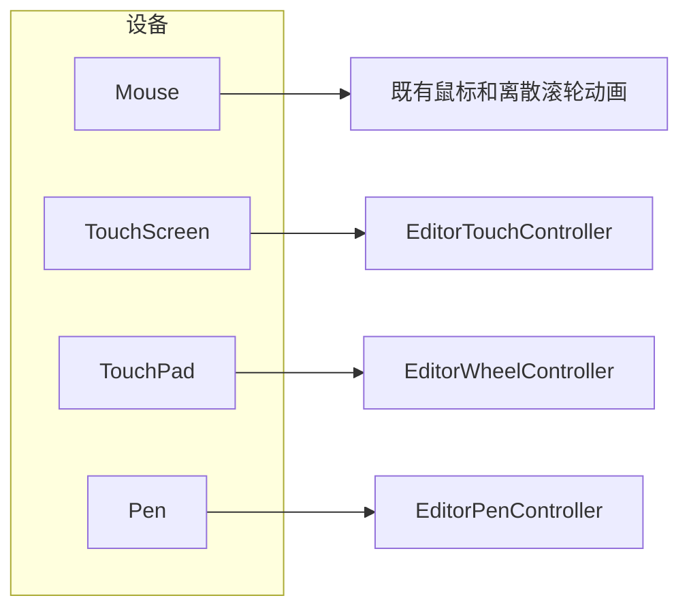

# 砍掉 Direct Manipulation，输入按设备种类处理

> 状态：待实施。真机已确认双指卡死由 Direct Manipulation 导致（2026-09-27，Surface，摘掉后双指平移和捏合完全正常）。实施完成后由提出本方案的会话验收，不要在实施对话里自己宣布通过。

## 目标

编辑器不再注册、不再链接 Windows Direct Manipulation。触屏、笔、精确式触摸板默认可用。外观设置里不留触摸相关开关，也不留说明文案。鼠标和离散滚轮保持原样。

精确式触摸板原先从 Direct Manipulation 得到的三件事改由编辑器完成：逐像素平移、手指位置上的横向和纵向捏合、松手后的惯性。

允许重构输入分发。设备种类以 `QPointingDevice::type()` 为准。不要再用 `QEvent::source()` 的粘滞值、配置开关或「先注册再按设备掩码过滤」来区分鼠标、触摸板、触屏和笔。

## 已确认的原因

`IDirectManipulationManager::Activate(hwnd)` 按整扇窗口接管输入。`Touchpad | Wheel` 只决定 QWDMH 把哪些 `WM_POINTERUPDATE` 送进 `SetContact`。触屏触点会被系统交出去，又没有任何视口认领，指针帧停在按下位置。心跳仍在，`WM_POINTER`、被提升的鼠标、`WM_TOUCH` 一起是 0。

因此禁止这些做法：

- 把 `registerWindow` 的设备掩码再收成 `Touchpad | Wheel` 后注册回去。
- 保留 `enableDirectManipulation`，只是默认改成 false。启动路径曾经无条件调用 `registerDirectManipulation()`，配置值挡不住 `Activate`。
- 在编辑器 HWND 上再调用 `Activate`。

## 设计决策

| 项 | 决策 |
| --- | --- |
| Direct Manipulation | 从依赖、链接、运行时注册里删除。不留编译开关 |
| 触屏、笔、精确式触摸板 | 始终开启 |
| 外观设置 | 删除整张 Touch 卡片。没有开关，没有提示文案 |
| 旧配置键 | `appearance.enableTouchGestures` 与 `appearance.enableDirectManipulation` 不再读写。旧文件里的键忽略，下次保存时消失 |
| 鼠标滚轮 | 仍走离散步进。平滑与否只由现有动画开关决定 |
| 精确式触摸板平移 | `pixelDelta` 即时加到视口，不进离散滚轮动画 |
| 精确式触摸板捏合 | 横向和纵向都缩放，锚点是手势位置的 x 和 y |
| 松手惯性 | 编辑器自己做。系统若已发送 `ScrollMomentum`，只应用那些增量，不再另起一段 |
| 触摸板与手指 | `TouchPad` 不是手指，不进入 `EditorTouchController` |
| 合成鼠标 | 按设备类型吞掉触屏提升出的那一路。不用 `event->source()` |

## 输入去向

- `Mouse`：不吞。离散滚轮在动画开时做动画，关时即时跳变。
- `TouchScreen`：`QTouchEvent` 交给 `EditorTouchController`。平台把主触点提升成的鼠标是重复流，吞掉。
- `Stylus`、`Airbrush`、`Puck`：仍走 `EditorPenController` 的 tablet 路径。笔尖、侧键、反端的现有语义不变。
- `TouchPad`：只走滚轮和 `QNativeGestureEvent`。

## 1. 删除 Direct Manipulation

从 `scripts/vcpkg-manifest/vcpkg.json` 去掉 `qt-win32-direct-manipulate-helper`。不要为此再跑一遍完整的 vcpkg 卸载。已安装的包留在 `vcpkg/installed` 里无妨，编辑器和 TouchProbe 不再查找、链接它。

`src/app/CMakeLists.txt` 与 `src/tools/TouchProbe/CMakeLists.txt` 删掉 `find_package(QtWin32DirectManipulateHelper)`、对应的 `LINKS_PRIVATE` 和 `WITH_DIRECT_MANIPULATION`。`src/app/CMakeLists.txt` 里若 `CorePrivate` 的 `find_package` 只为这个助手存在，一并删掉。目标本身已经链接 `GuiPrivate` 的不要误删。

删掉这些运行时挂钩：

- `src/app/AppContext.cpp` 的 `DirectManipulationHolder` 及其构造、析构。
- `src/app/main.cpp` 在 `show()` 之后的 `registerDirectManipulation()`。
- `src/app/UI/Window/MainWindow.h` 的 `registerDirectManipulation`、`unregisterDirectManipulation` 和 `m_isDirectManipulationRegistered`。
- `src/app/UI/Window/MainWindow.cpp` 的 `registerScopedDirectManipulation`、外观选项变化时的注册、内嵌设置打开时卸下和关闭时再注册、分离底栏的注册与卸下。

`src/app/UI/Views/Common/EditorWheelController.cpp` 的 `isEditorWheelAnimationEnabled()` 不再读取 Direct Manipulation 开关。离散滚轮动画只跟外观里的动画开关走。精确式触摸板的像素增量本来就不是离散事件，不进这档动画。

`src/tools/TouchProbe/main.cpp` 去掉 Direct Manipulation 按钮、`D` 键和 `DirectManipulationSystem` 对象。探针继续观察指针、滚轮和原生手势，不再注册任何视口。

实施后全仓库不再出现 `WITH_DIRECT_MANIPULATION`、`QWDMH`、`DirectManipulationSystem`、`registerDirectManipulation`。

## 2. 砍掉设置

`src/app/UI/Dialogs/Options/Pages/AppearancePage.cpp` 与 `.h` 删除整张 Touch 卡片，包括「多点触控手势」和「精密触控板与滚轮滚动」两个开关及其说明。卡片空了就不要留空标题。

`src/app/Model/AppOptions/Options/AppearanceOption.h` 与 `.cpp` 删除 `enableTouchGestures`、`enableDirectManipulation` 及对应的键。`load` 不读这两项。`save` 不写这两项。不要把缺键解释成关闭。

`src/app/Automation/SettingsAutomationFacade.h` 和 `src/app/Automation/AppOptionsAutomationAdapter.cpp` 删除同样的两个字段。若公共自动化描述里暴露了它们，一并删除。不要保留「始终为 true」的假字段。

`EditorTouchController::isEnabled()` 删除。控件始终接受 `QTouchEvent`。`handleTouchEvent` 里「开关关闭则不 accept、退回 Qt 合成鼠标」的分支删除。

`src/app/UI/Views/Common/EditorSystemGestureSuppressor.cpp` 在已登记的编辑区窗口上始终用 `TABLET_DISABLE_PRESSANDHOLD` 应答 `WM_TABLET_QUERYSYSTEMGESTURESTATUS`。不要再读外观选项。

翻译文件不要手改。源码里的 `tr()` 去掉之后，下次 `lupdate` 会自己丢掉条目。

## 3. 精确式触摸板

Qt 在窗口没有 `Activate` 时，把 `PT_TOUCHPAD` 交成带 `pixelDelta` 和滚动相位的 `QWheelEvent`，把捏合交成 `QNativeGestureEvent`。`src/libs/GUI/Controls/WheelInputController.cpp` 对 `pixelDelta` 已经是即时平移。

触摸板逻辑收进 `src/app/UI/Views/Common/EditorWheelController.cpp`。下面三处现在各写一遍捏合，改成调用这一处，不要再复制：

- `src/app/UI/Views/Common/TimeGraphicsView.cpp` 的 `event()`
- `src/app/UI/Views/ClipEditor/PianoRoll/PianoRollRhiWidget.cpp` 的 `event()`
- `src/app/UI/Views/TrackEditor/TracksRhiWidget.cpp` 的 `event()`

平移：

- 设备类型是 `TouchPad` 且带 `pixelDelta` 时，继续即时改视口，并按最近一段时间的位移记下速度。
- 相位是 `ScrollEnd` 时，用和双指平移同一套衰减做松手滑行。`EditorTouchController::onInertiaFrame` 的常数是间隔 16 ms、衰减 3.6/秒、低于 20 px/s 停止。触摸板沿用这组数，不要另起一套手感。
- 新的滚轮、原生手势或鼠标按下到来时停掉滑行。
- 相位已经是 `ScrollMomentum` 时，系统自己在滑。只应用这些增量，不要再启动编辑器的滑行，避免两段惯性叠在一起。

捏合：

- 处理 `BeginNativeGesture`、`ZoomNativeGesture`、`EndNativeGesture`。
- 锚点用事件位置映射到控件后的 x 和 y。横向和纵向都缩放，与双指 `zoomTouchViewportBy` 的两个因子一致。现在 `handleNativeGesture` 只缩放横向，而且锚点只有 x，这是要改掉的。
- `EndNativeGesture` 时按最近的缩放速度做一段短惯性，衰减可与平移同一套。下一次滚轮、手势或按下取消它。
- `BeginNativeGesture` 到来时停掉正在进行的平移惯性和缩放惯性。

`TouchPad` 的事件不要送进 `EditorTouchController`。`EditorPointer::isTouchDevice()` 只认 `TouchScreen`，去掉现在对 `TouchPad` 的或条件。这个函数目前没有别的调用点，定义仍要改对，避免以后把触摸板当成手指。

## 4. 按设备种类分发

`EditorTouchController::swallowForeignMouseEvent` 现在用 `event->source() == Qt::MouseEventNotSynthesized` 决定放行。这个 `source` 在 Windows 上是粘滞的：触点之前若有一条鼠标或触摸板的 `WM_POINTER`，被提升的触摸鼠标会以 `MouseEventNotSynthesized` 进来，两指操作里跑出一路幽灵拖拽。

改为看 `pointingDevice()->type()`：

- `TouchScreen`：这是平台提升出的重复鼠标，接受并吞掉。
- `Mouse`：放行。
- `TouchPad`：放行到滚轮和原生手势路径，不要当成手指。
- 笔设备：放行，由钢笔层处理。

`sendSyntheticMouse` 仍把触摸设备放进事件，`EditorPointer` 靠它认出手指驱动的鼠标流。`QCoreApplication::sendEvent` 是同步的。发送前后用一个成员标志包住，吞掉判断看到这个标志就放行，避免吃掉自己合成的按下、移动和抬起。不要改成把合成事件的设备改成鼠标，那会让 `EditorPointer` 的手指流判断失效。

钢笔层现有的「真鼠标移动时清掉笔的悬停光标」已经按 `DeviceType::Mouse` 判断，保持不动。

## 5. 文档

更新 `docs/design/touch-and-pen-input-design.md`：

- 第一节分流表里，精密触控板和滚轮不再写 Direct Manipulation。触控板改由编辑器处理，滚轮仍是离散滚轮加动画开关。
- 「DirectManipulation 作用域收缩」整小节删除，改成一句已移除的原因：`Activate(hwnd)` 会按整窗吞掉触屏。
- 第十节设置表删除「多点触控手势」和「精密触控板与滚轮滚动」两行。写明这两类输入没有开关。

更新 `docs/automation/01-automation-facade/gui-regression-matrix.md`：删除 `CAP-DIRECT-MANIPULATION`，以及 GUI-G17 里切换 Direct Manipulation 开关的步骤。外观页不再有这张卡片，自动化不要再找这两个控件。

`docs/plans/animation-toggle-plan.md` 是已完成方案的历史记录，不要改。

## 验收

实施对话不要自己宣布通过。留下构建结果和改动说明，交给本方案的提出会话对照下面各项。

- 全仓库没有 `WITH_DIRECT_MANIPULATION`、`QWDMH`、`registerDirectManipulation`、`enableDirectManipulation`、`enableTouchGestures`。
- 外观设置没有 Touch 卡片，也没有触摸、触摸板、笔的开关或说明。
- 旧 `appConfig.json` 里残留的那两个键不会把触屏或滚轮动画关掉，保存后键消失。
- 鼠标滚轮仍受动画开关控制。精确式触摸板的像素平移不走这档动画。
- 钢琴卷帘、参数编辑器、轨道编排区的捏合都调用 `EditorWheelController`，横向和纵向都缩放，锚点含 x 和 y。
- `ScrollEnd` 有编辑器惯性。`ScrollMomentum` 不会再叠一段。新输入能停掉滑行。
- 吞合成鼠标看设备类型，不看 `source()`。自己的 `sendSyntheticMouse` 不会被吞掉。
- `isTouchDevice` 不包含 `TouchPad`。
- `package-dml-portable` 的 `DsEditorLite` 能配置并链接通过。TouchProbe 不再提供 Direct Manipulation 开关。
